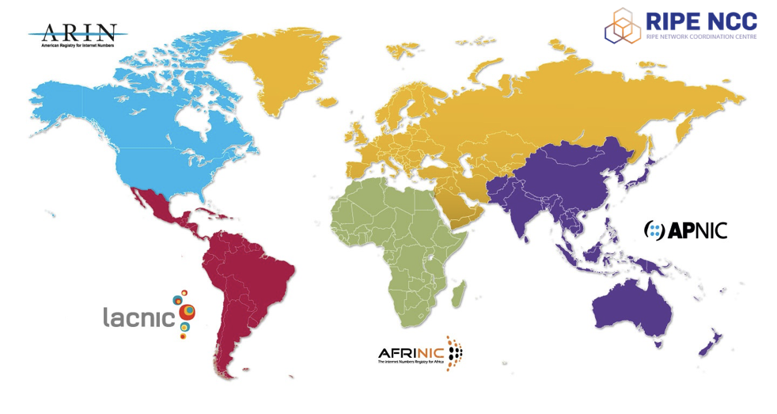

# MANRS-like Document for Enterprise Networks

## Target audience 

- Enterprise Networks
- Academic / Research
- Banking / Financial
- Data Centre / Cloud Services
- Media / Entertainment
- Enterprise / Manufacturing / Retail 
- Government / Regulator
- Infrastructure (Transport / Hospital)
 
## 1 - Introduction 

In recent years the number of Enterprise and "End site" organisations that decide to acquire their own internet number resources has grown.  Their goal is to have more control over their routing, their security and their online presence.  This means that organisations that used to depend on their ISPs to provide such services, now have to manage their online presence on their own.
 
At the same time, cyber attacks are becoming more aggressive and invasive.  These attacks include DoS (Denial of Service) and DDoS (Distributed Denial of Service), spoofing and also hijacks.

Reactive approaches to building and securing the Internet by running after security threats and buying appliances to combat them is not the best way to build a better internet. The answer is to help minimize exploiting the technology to run an attack.

## 2 - Definitions

**ASN:** An Autonomous System Network is a unique identifier - a number -  assigned to independent networks by the Regional Internet Registries.   It is used by the Border Gateway Protocol (BGP) to identify a network  and all its components, and to establish BGP Peering sessions.  An ASN is a connected group of one or more IP prefixes run by one or more network operators which has a SINGLE and CLEARLY DEFINED routing policy.

**BGP:** Border Gateway Protocol.  It's the protocol used by networks to exchange routing information.  It is the routing protocol of the Internet, and it's fundamental in making addresses reachable from the rest of the world.

**IP Address:** 

**IPv4:** 

**IPv6:** 

## 3 - Principles

### 3.1 - Identification -Building your own resilient network identity.

### 3.2 - Filtering – Preventing propagation of incorrect routing information

### 3.3 - Anti-Spoofing - Preventing traffic with spoofed source IP addresses

### 3.4 - DDoS mitigation 

### 3.5 - Validation & Certification (Internet Resource, web, mail)
 
## 4 - Expected Actions

### 4.1 - Identification -Building your own resilient network identity.

#### 4.1.1 - Internet Number Resource Management System

The unallocated Internet Number Resources are managed globally by the Internet Assigned Numbers Authority (IANA). Think of it as the global reservoir of resources.  These resources are streamed down through five regional Internet registries (RIR), each responsible for a large geographical region of approximately continental size. These RIRs are responsable for the distribution of these Internet Number Resources to end users and local Internet registries (LIRs), such as Internet service providers.  The RIRs are also responsable for keeping an up to date record on the current holders of the resources they have distributed.  This is done using the RIR Databases, such as the [RIPE Database](http://www.ripe.net/whois).

Publicly used Internet Number Resources have to be unique* to insure the delivery of the traffic to its intended destination.

#### 4.1.2 - Why get your own ASN?

##### Case study: Media / Entertainment (MBC Group)

#### 4.1.3 - Multihoming

#### 4.1.4 - Why get your own IP addresses (IPv4 & IPv6)

##### Case study: Banking / Financial (Rabobank)

#### 4.1.4 - Maintaining Contact Information in Regional Internet Registries (RIRs)

### 4.2 - Filtering – Preventing propagation of incorrect routing information
#### 4.2.1 

### 4.3 - Anti-Spoofing - Preventing traffic with spoofed source IP addresses
#### 4.3.1 

### 4.4 - DDoS mitigation

#### 4.4.1

### 4.5 - Validation & Certification (Internet Resource, web, mail)

#### 4.5.1 - RPKI

#### 4.5.2 - TLS

#### 4.5.3 - DNSSEC & DANE

## 5 - References
